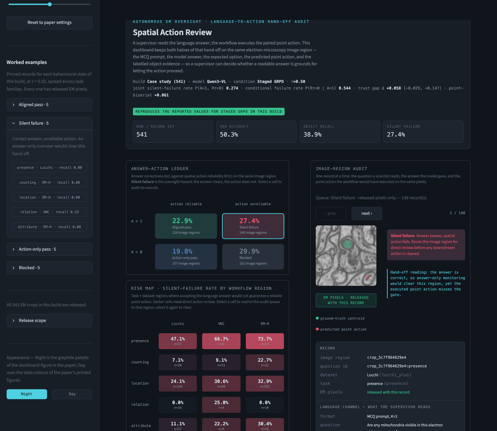

# Spatial Action Review

Live visual analytics dashboard for auditing **language-to-action hand-offs** in
electron-microscopy image analysis. A multimodal LLM produces a language answer
that a supervisor can inspect, and a point-set action that an analysis workflow
may execute — seeding a segmentation, prioritising an image region, or selecting
a field of view for reacquisition. Those are two different objects of oversight.
This dashboard keeps both on the same image region, so a supervisor can decide
whether a readable answer is grounds for letting the action proceed.

Companion artifact to *Spatial Action Review: A Visual Analytics Dashboard for
Auditing Language-to-Action Hand-offs in Electron Microscopy* (VAxAutoSci @ IEEE
VIS).



## Quick start

```bash
python -m venv .venv && source .venv/bin/activate
pip install -r requirements.txt
streamlit run app.py
```

Opens on <http://localhost:8501>. Nothing else is needed — the audit record set
ships in `release/`.

## Deploying the public demo

The release is ~39 MB of PNG crops plus a 250 KB record table, so it commits
directly to GitHub with no Git LFS and no external data host.

1. Push this directory to a public repository.
2. On [share.streamlit.io](https://share.streamlit.io), point a new app at the
   repo, branch, and `app.py`. `requirements.txt` and `.streamlit/config.toml`
   are picked up automatically.

## Audit sources

The paper reports two builds that share one scoring definition and differ only in
their exported record sets. Both ship, and a third source audits a run of your
own — all selectable in the sidebar.

| Source | What it is |
| --- | --- |
| **Case study (541)** — default | Qwen3-VL **Staged GRPO** over 541 paired image regions. The run traced end to end in the paper: teaser figure, answer-action ledger (Table 1), risk map (Table 2), Section 4.1 global signals. |
| **SFT-variant audit (753)** | Qwen3-VL zero-shot / Perception SFT / Grounding SFT / Staged SFT / Joint SFT, 753 paired records each. The re-audit table (Table 3), showing how the same measures behave after each adaptation. |
| **Your own run (upload)** | Any `inspector_data.json` in the paired answer-action schema, plus an optional zip of crops named `<crop_id>.png`. Nothing is baked in: the states, ledger, risk map, and every summary are recomputed from `answer_correct` and `obj_recall` at the τ you pick, and the file's own `quadrant` labels are ignored. Fields the file omits are reported as absent rather than rendered as zeros. |

## What the dashboard shows

| View | What it is |
| --- | --- |
| **Answer–action ledger** | The four behavioural states from answer correctness `A(c)` and action reliability `Rτ(c)`: aligned pass, **silent failure**, action-only pass, blocked. Silent failure is the oversight hazard — the answer clears, the executed action does not. Selecting a cell filters the audit queue. |
| **Risk map** | Silent-failure rate per task × dataset workflow region, at the manuscript's precision. Selecting a cell restricts the audit queue to that region; selecting it again clears. |
| **Image-region audit** | One record: the EM crop with ground-truth centroids (green crosses) and the model's predicted point action (red rings), the MCQ prompt and options with the expected and picked letters marked, the model answer, and every action metric. |
| **Threshold sensitivity** | Silent-failure and aligned-pass rates as τ sweeps 0.05–0.95. Both curves cover only answer-correct records, so together they are everything an answer-only overseer would clear — and the split between them shows how much of that is actually backed by a usable action. |
| **Stray-action flag** | The action gate is built from object *recall*, so it asks only whether enough objects were covered — it is blind to extra points that hit nothing. Every record is checked for those, and a record that clears the gate while still emitting points on empty image is flagged red. Across the case study, **74% of gate-clearing regions** emit at least one such point, and **42% of all points those regions would hand to the workflow hit nothing**. |
| **Routing decision** | The audit ends in a decision, not a metric: accept the action, send the region to human audit, hold it for a stricter gate, or flag the model for revision. Each decision is stored with the gate and behavioural state it was taken under. |
| **Re-audit across conditions** | The reliability row for every SFT variant at the current τ — the re-audit loop, interactive. |
| **Review log** | Every decision taken this session, with counts per route, a stale-gate warning when the threshold has since moved, and CSV/JSON export. |
| **Live model** | Optional. Re-ask the checkpoint under audit through any OpenAI-compatible endpoint and see the fresh answer and points beside the recorded ones. Off unless configured. |

### Controls

- **Audit build** — case study (541) or SFT-variant audit (753).
- **Model condition** — shown when the build has more than one.
- **τ** — the action-reliability gate, `Rτ(c) = 1[obj_recall(c) ≥ τ]`. Defaults
  to 0.50, the permissive partial-coverage gate used in the paper. Any other
  value is labelled exploratory in the header.
- **Worked examples** — five pinned records per behavioural state, spread across
  task families, all with at least one labelled object.
  Selected by deterministic rules in `tools/build_release.py` rather than
  hand-picked ids.
- **Appearance** — Night or Day, top right of the workspace. Both palettes are
  defined in `sar/theme.py` and drive the crop tiles as well as the chrome.

## Reproducing the paper's numbers

At τ = 0.50 the dashboard reproduces the submitted manuscript exactly, including
the bootstrap confidence intervals (`numpy.random.default_rng(0)`, 2000
resamples, matching Section 3.5). That is asserted, not asserted-by-eye:

```bash
python -m pytest tests -q      # 78 passed
```

The suite pins:

- **Section 4.1** — 50.3% VQA accuracy, 38.9% object recall, `P(A=1,Rτ=0)` =
  27.4%, `P(Rτ=0|A=1)` = 54.4%, Δ = 0.058 with interval [−2.9, 14.7] pp,
  point-biserial 0.061, over 541 records.
- **Table 1** — all four ledger counts (124 / 148 / 107 / 162) and rates.
- **Table 2** — all fifteen risk-map cells, rate and count.
- **Table 3** — all five SFT-variant rows including every bootstrap interval,
  plus the quoted ranges in Section 4.5 and that every interval includes zero.
- **Probe widths** — the K distributions and the 26.3% / 26.4% uniform-choice
  baselines, and that the 26 single-option records are 4.8% of the run.
- **Stray-action accounting** — every emitted point is either on target or
  stray, on-target never exceeds the object count, and the flag only fires on
  records that clear the gate.
- **Sign-off bookkeeping** — a decision stores its gate and state, re-deciding
  replaces rather than duplicates, and a decision taken at another gate is
  reported stale rather than silently re-evaluated.
- **The live-scoring port** — the same edge cases as the offline scorer, one
  object never matched twice, point-tag parsing, and option-letter recovery.
- **The upload path** — both published exports, fed through the *upload* loader
  instead of the release loader, still reproduce their published rows and the
  full risk-map table. If that loader guessed at anything, those numbers would
  move. Plus its refusals: malformed payloads, coordinate lists longer than
  `n_gt`/`n_pred`, zip path traversal, and unmatched image names.
- **Structural invariants** — quadrants partition each build, risk-map cells sum
  to the record set, the gate is monotone in τ, no overlay draws more points than
  the record was scored on, all coordinates lie in the unit square, and the
  case study never needs a placeholder tile.

## Rebuilding the release

```bash
python tools/build_release.py            # from ../plan and ../outputs
python tools/build_release.py --check    # verify checksums and image count
```

The builder is strict on purpose. It aborts if `inspector_data.json` is not the
541-record Staged GRPO export, if an exported quadrant disagrees with the τ = 0.5
gate, if an SFT condition lacks exactly 753 per-record rows, or if a record's
point or centroid counts disagree with its scores. An inconsistent release fails
the build instead of quietly reaching the dashboard.

See [PROVENANCE.md](PROVENANCE.md) for the full source map and release scope, and
[RUN_ON_GPU.md](RUN_ON_GPU.md) for step-by-step commands to fetch the missing
artifacts, serve a checkpoint, and reach it from the dashboard.

## Layout

```
app.py                        page layout and interaction state
sar/data.py                   release loading, Rτ gate, states, bootstrap
sar/ingest.py                 loading an arbitrary inspector_data.json
sar/review.py                 routing decisions and the review log
sar/scoring.py                point-action scoring for live re-asks
sar/serve.py                  optional OpenAI-compatible model client
sar/render.py                 crop tile with GT / predicted-point overlays
sar/theme.py                  the Night and Day palettes
sar/ui.py                     stylesheet and static HTML blocks
tools/build_release.py        builds release/ from the analysis artifacts
tests/                        the manuscript-parity contract
RUN_ON_GPU.md                 fetching artifacts, serving a checkpoint, tunnelling
release/records.csv.gz        4,306 audit records across both builds
release/images/               753 crop images, 256×256
release/manifest.json         schema, checksums, reference values, demo cases
```

## Two things this app will not do

- **It never synthesises an image.** All 753 crop images ship with the app, so
  both shipped sources are fully covered. An uploaded run with missing images
  keeps every numeric and textual field and draws its point geometry on a
  labelled blank grid instead. An audit tool that invents plausible evidence is
  worse than one that admits a gap.
- **It never borrows a metric across conditions.** Point F1 and point-in-mask
  precision are absent from the 541-record export and are joined from a score
  file for that same condition, which the builder rejects unless it agrees with
  the export on answer correctness, object recall, and both point counts for
  every record. Where a metric is genuinely unavailable the panel says so rather
  than showing a zero.
