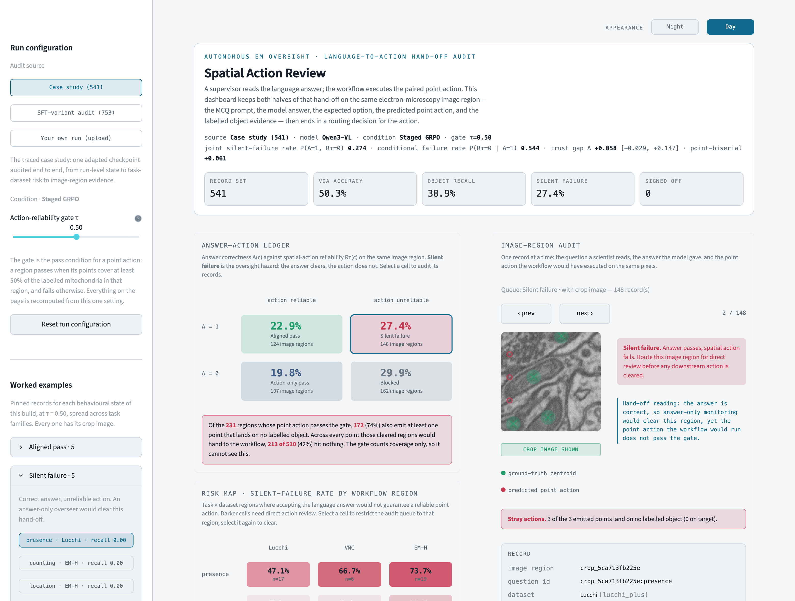

# Spatial Action Review

A dashboard for checking whether a vision-language model's *answer* about a
microscope image supports the paired point action before that action is cleared
for downstream use.

In an automated electron-microscopy workflow the model can produce two linked
outputs. It answers a question a scientist can read — *"are there mitochondria
here?"* — and it returns a set of points that a downstream process may consume:
seeding a segmentation, choosing where to look next, or flagging a region for
review. This dashboard puts both halves side by side on the same image region and
ends in a recorded routing decision for the proposed action. It does not execute
segmentation, trigger reacquisition, control a microscope, or use an MCP server.

Companion to *Spatial Action Review: A Visual Analytics Dashboard for Auditing
Language-to-Action Hand-offs in Electron Microscopy* (VAxAutoSci @ IEEE VIS 2026).



## Run it

```bash
python -m venv .venv && source .venv/bin/activate
pip install -r requirements.txt
streamlit run app.py
```

It opens at <http://localhost:8501>. The audit data ships with the app; there is
nothing else to configure.

## What you are looking at

**Answer–action ledger.** Every image region falls into one of four states,
depending on whether the answer was right and whether the points were usable:

| | points usable | points not usable |
| --- | --- | --- |
| **answer correct** | aligned pass | **silent failure** |
| **answer wrong** | action-only pass | blocked |

Silent failure is the state the dashboard is built around: the answer reads fine,
the action underneath does not. Select any cell to work through its regions.

**Risk map.** The silent-failure rate by question type and dataset, so you can see
where it concentrates. Select a cell to narrow the audit queue to that region;
select it again to clear.

**Image-region audit.** One region at a time — the microscope crop with green
crosses on the labelled mitochondria and red rings where the model pointed, the
question, the options, the model's answer, the expected answer, and every score.

**Routing decision.** Each audited region ends in a disposition: accept the action,
escalate for expert review, hold for a stricter gate, or flag for model revision.
Decisions are saved with the gate value they were made under and export as CSV or
JSON from the **Review log** tab.

**Action-reliability gate.** A region's point action passes when object recall is
at least τ. The reported default is τ = 0.50. The **Threshold sensitivity** tab
shows how the ledger changes as this gate moves.

**Stray actions.** Points that land on no ground-truth object are counted separately
and flagged, since the gate measures coverage rather than precision.

**Shareable views.** Source, condition, τ, ledger selection, risk-map cell, open
record and theme all live in the URL, so any view of the dashboard can be linked
and reopened exactly:

```
?source=case_study&condition=staged_grpo&tau=0.5&state=silent_failure&record=crop_5ca713fb225e
```

## The data

Three sources, chosen in the sidebar:

| Source | What it is |
| --- | --- |
| **Case study (541)** | The run followed end to end in the paper: one adapted Qwen3-VL checkpoint over 541 image regions. |
| **SFT-variant audit (753)** | Five Qwen3-VL conditions — Zero-shot, Perception SFT, Grounding SFT, Staged SFT, Joint SFT — over the same 753 matched records. |
| **Your own run** | Upload your own results and the dashboard audits them the same way. |

4,306 audit records and 753 microscope crops (~39 MB), all in the repository. No
database, no external service.

To audit your own model, export it as `inspector_data.json` in the paired
answer–action schema and load it through **Your own run**, optionally with a zip of
crops named `<crop_id>.png`. Required per record: `crop_id`, `dataset`, `task`,
`answer_correct`, `obj_recall`, `n_gt`, `n_pred`. Used when present:
`question_id`, `vqa_question`, `vqa_choices`, `expected_letter`, `expected_answer`,
`pred_answer_snippet`, `gt_centroids`, `pred_points`, `point_f1`, `pim_prec`,
`count_ae`, `probe_id`.

Try it without a run of your own: the **Your own run** tab's "Try it without a
run of your own" panel offers a 10-record `example_inspector_data.json` and its
matching `example_crops.zip` (also in [`examples/`](examples)) — download both
and re-upload them to see the whole flow with no model of your own required.

### Preparing your own export

Three fields — `vqa_choices`, `gt_centroids`, `pred_points` — can each be
exported as either a native JSON list or a JSON-*encoded string* of one; both
occur in this project's own artifacts (`plan/inspector_data.json` writes
`vqa_choices` as a list, the release build's own CSV export writes it as a
string). The dashboard's loader (`sar/ingest.py`) accepts either, so this is
never a problem for the upload tab itself — but anything else that reads the
raw file (a notebook, a metrics script) will get a different answer for
`len(vqa_choices)` depending on which form it assumes, unless it goes through
the same normalisation.

`tools/prepare_upload.py` runs an arbitrary export through that normalisation
and writes back a canonical file with every ambiguous field in its one native
list form, so there is only one representation to reason about on disk and in
the dashboard. It also validates the required fields per record, so a file it
accepts is a file the upload tab accepts:

```bash
python tools/prepare_upload.py my_export.json -o inspector_data.json \
    --images crops/ --images-zip crops.zip
```

It accepts a bare list, `{"crops": [...]}`, or `{"records"|"data"|"results": [...]}`
as input, and prints the record count, the dataset/task breakdown, and the same
option-count (K) distribution and mean(1/K) uniform-choice baseline the
dashboard's case-study read-out reports, so you can sanity-check a run before
uploading it. If your source uses different field names, map them first:

```bash
python tools/prepare_upload.py my_export.json -o inspector_data.json \
    --rename id=crop_id --rename is_correct=answer_correct \
    --model "My-VLM" --condition "zero-shot" --drop-invalid
```

`--drop-invalid` skips records missing a required field instead of failing the
whole run; omit it to see exactly which records and fields are missing first.

## Reproducing the paper

The tests hold the dashboard to the published values — the headline figures, the
four ledger counts, all fifteen risk-map cells, and every model condition with its
bootstrap interval:

```bash
python -m pytest tests -q
```

Every number the manuscript quotes is recomputed from the shipped records:

```bash
python scripts/paper_numbers.py          # the full report
python scripts/paper_numbers.py --json   # machine-readable
```

The figure panels are captured from the running dashboard by URL:

```bash
pip install -r requirements-dev.txt && playwright install chromium
python scripts/capture_figures.py
```

To rebuild the data files from the original analysis outputs:

```bash
python tools/build_release.py            # rebuild
python tools/build_release.py --check    # verify checksums and image count
```

## Deploying

The repository is self-contained and deploys as-is to
[Streamlit Community Cloud](https://share.streamlit.io) — point it at this
repository and `app.py`.

Re-querying a live model from the audit view is optional. It is inactive unless an
OpenAI-compatible endpoint is configured through the **Live model** tab or the
`SAR_MODEL_BASE_URL`, `SAR_MODEL_NAME` and `SAR_MODEL_API_KEY` environment
variables.

## Files

```
app.py                       the page
sar/                         loading, scoring, rendering, sign-off, URL state, model client
tools/build_release.py       rebuilds the data files
tools/prepare_upload.py      normalises an arbitrary export for the upload tab
scripts/                     paper numbers, figure capture
tests/                       the checks against the paper
release/                     the audit records and the crop images
examples/                    a 10-record example upload (JSON + crop images)
```

## Scope

The dashboard; the 4,306 audit records and 753 crops; the scoring and
reliability analysis; the builder that assembles the records; the tests that hold
all of it to the published values. The model-training code that adapted the Qwen3-VL checkpoints (both the supervised and reward-based fine-tuning recipes) and the resulting adapter weights will be released at a later date alongside a separate publication. The audit reproduces without them: the records already carry
each model's answers and predicted points.

## Licence and citation

The code, documentation and analysis are licensed under the **GNU Affero General
Public License v3.0 or later** (`AGPL-3.0-or-later`) — see [LICENSE](LICENSE). Use,
study, modify and share it freely; if you distribute a modified version, or run one
as a network service, make your source available under the same licence.

To cite it, see [CITATION.cff](CITATION.cff), or cite the paper directly.

The microscope crops in `release/images/` derive from the public **Lucchi**, **VNC**
and **MitoEM** datasets, which carry their own terms and are cited in the paper.
